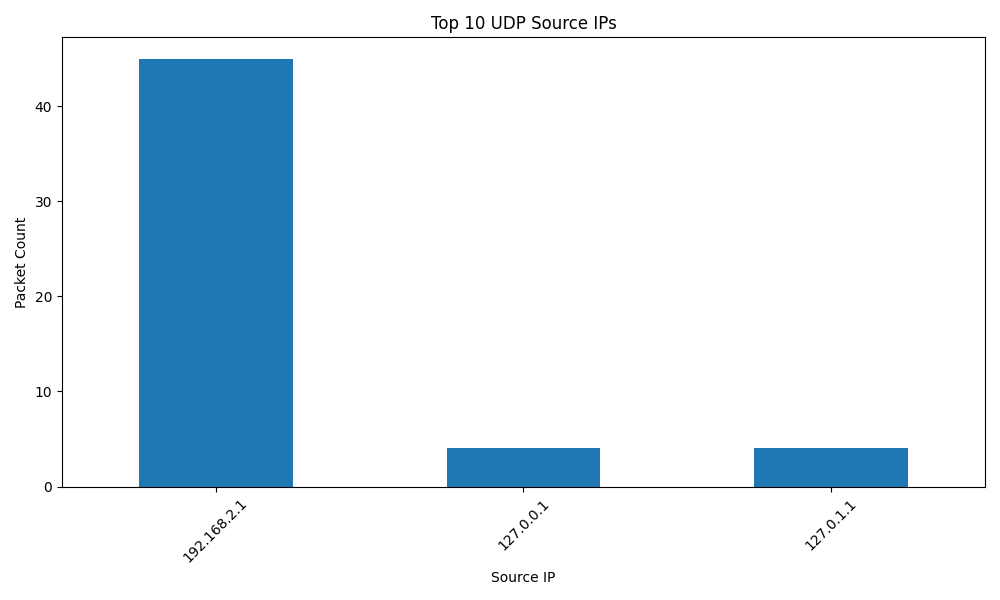

# 🧪 network-test-utils

Wireshark-powered packet analysis tools for real-world 4G/5G testing.

## 🚀 Features
- 🔍 Parse `.pcapng` files with `pyshark`
- 🧹 Extract Layer 3/4 fields (IP, port, protocol)
- 📊 Export clean `.csv` for analysis
- 📈 Visualize packet source IP patterns
- 🛠️ Easily extendable for ML-based anomaly detection

## 📂 Project Structure
```
network-test-utils/
├── pcap_samples/           # Sample capture files (.pcapng)
├── scripts/                # Python parsing & plotting scripts
├── output/                 # Auto-generated CSV output
├── viz/                    # Visualizations (png, pdf)
└── requirements.txt        # Dependencies
```

## 📦 Quick Start

```bash
git clone https://github.com/Milzon1010/network-test-utils.git
cd network-test-utils
pip install -r requirements.txt
python scripts/pcap_parser.py pcap_samples/yourfile.pcapng
```

## 📈 Example Output


## 🧠 Next Plans
- Add anomaly flagging for:
  - VoNR dropouts
  - Port/Protocol flood
  - Suspicious handover gaps
- Build Streamlit UI for log upload & live analysis

---

## 👨‍💻 Author
**Milzon**  
Network Test Manager | Telco x ML/AI Explorer  
[LinkedIn](https://www.linkedin.com/in/milzon)
